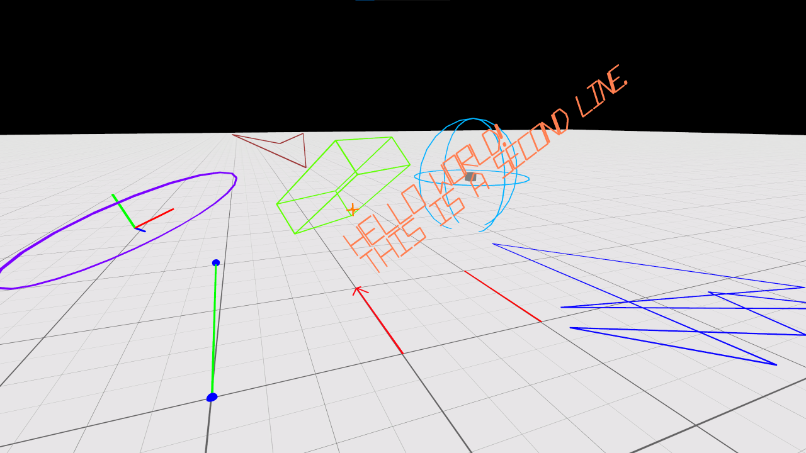
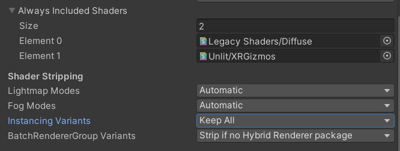

# XRGizmos

This is an expansion on a technique that Unity demonstrated in their SuperScience library:

[https://github.com/Unity-Technologies/SuperScience/tree/main/Runtime/GizmoModule]()

XRGizmos offers a set of methods to draw primitives similar to Unity's Gizmos class:
* DrawLine
* DrawRay
* DrawSphere
* DrawWireSphere
* DrawCube
* DrawWireCube

It also offers several new methods for other useful shapes:
* DrawPoint
  * A 3d plus shape to mark a point in 3d space
* DrawCircle
  * 2d outline of a circle
* DrawArrow
  * 2d direction indicator
* DrawPointer
  * A ray with an arrow at the end
* DrawWireHemisphere
  * Half a sphere
* DrawAxis
  * Draw the up, right, and forward axes of a transform
* DrawString
  * Draw a multi-line string in 3D space

## Advanced
* DrawLineList
  * Pass in a list of Vector3s and it will connect them with lines.
* DrawPointSet
  * Pass in a list of Vector3s and it will mark them all with a point. ~300 points in a single draw call
* DrawWireCubes
  * Pass in a list of Vector3, a rotation and size and it will draw them all. Useful for grids.
  
## Troubleshooting
To enable XRGizmos you need to add an "XR_GIZMOS" define in your Player Settings. This is so you can easily disable the debug drawing in release builds.

If XRGizmos are drawing in the editor, but they are not showing up in builds the instancing variants of the gizmos shader may be getting stripped from the build.

To workaround this you can add the gizmos shader to the "Always Included Shaders" array in Graphics Settings and change "Instancing Variants" from "Strip Unused" to "Keep All."

The font used to draw text is a modified version of coolbutuseless' "arcadefont":
[https://github.com/coolbutuseless/arcadefont]()

If you need more features or better performance than this tool, I recommend the [ALINE](https://assetstore.unity.com/packages/tools/gui/aline-162772) tool available in the Unity Asset Store.
